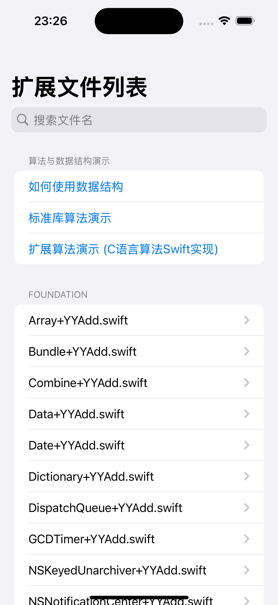
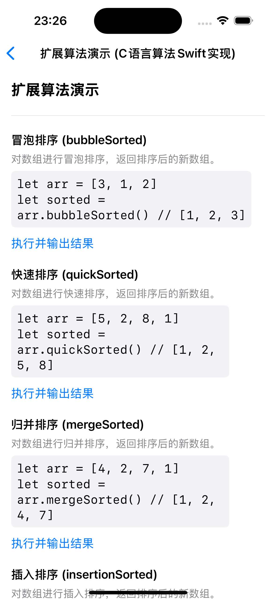
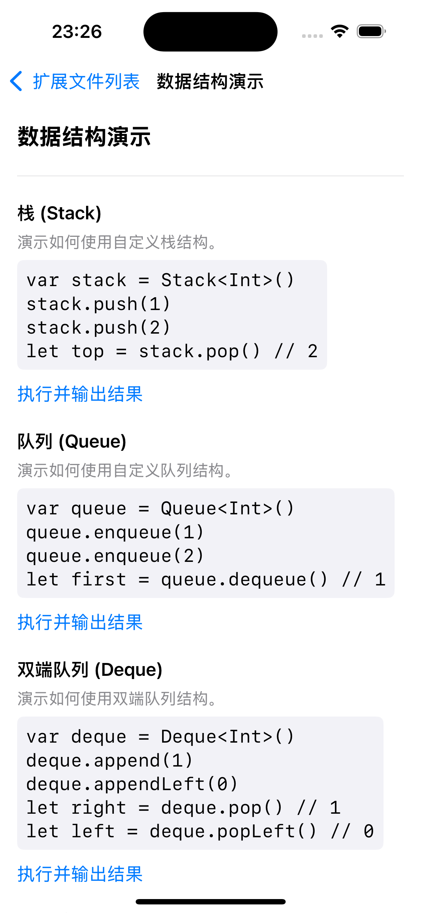

# SwiftExtensions

[](LICENSE)

> 高效、实用的 Swift 扩展合集，涵盖 Foundation、UIKit 及常用算法与数据结构，助力 iOS/macOS 开发。

---

## 目录
- [特性 Features](#特性-features)
- [目录结构 Directory Structure](#目录结构-directory-structure)
- [安装与使用 Installation & Usage](#安装与使用-installation--usage)
- [演示功能 Demos](#演示功能-demos)
- [演示截图 Screenshots](#演示截图-screenshots)
- [贡献 Contributing](#贡献-contributing)
- [许可证 License](#许可证-license)
- [联系方式 Contact](#联系方式-contact)

---

## 特性 Features
- 🚀 丰富的 Swift 扩展，提升开发效率
- 🧩 分类清晰，易于查找和维护
- 📦 适用于 iOS/macOS 项目
- 🤝 欢迎社区贡献
- 📚 **内置数据结构与算法演示，便于学习与测试**

## 目录结构 Directory Structure

```
SwiftExtensions/
  Extensions/
    Foundation/   # Foundation 相关扩展
    UIKit/        # UIKit 相关扩展
    Other/        # 其它扩展（如算法、数据结构等）
```

## 安装与使用 Installation & Usage

1. **克隆仓库 Clone the repo**
   ```bash
   git clone https://github.com/lzy201314/SwiftExtensions.git
   ```
2. **将需要的扩展文件拖入你的 Xcode 项目**
3. **或通过 Swift Package Manager 集成（如后续支持）**

## 演示功能 Demos

项目首页内置【算法与数据结构演示】分组，包含：

- **数据结构演示**：
  - 栈、队列、双端队列、单向链表、双向链表、最小堆、最大堆、字典树、并查集等
  - 支持一键运行、查看输入输出
- **算法演示**：
  - 标准库算法演示：用 Swift 标准库方法（如 sorted、firstIndex）演示常见算法
  - 扩展算法演示（C语言算法Swift实现）：调用本项目自定义扩展方法（如 bubbleSorted、quickSorted、unique 等）
  - 每个算法均可一键运行、查看输入输出

> 适合学习、测试、对比标准库与自定义算法实现。

## 演示截图 Screenshots

首页分组与扩展文件列表：



扩展算法演示页面：



数据结构演示页面：



## 贡献 Contributing
欢迎 issue、PR 或建议！

1. Fork 本仓库
2. 新建分支 (`git checkout -b feature/your-feature`)
3. 提交更改 (`git commit -am 'Add new feature'`)
4. 推送分支 (`git push origin feature/your-feature`)
5. 新建 Pull Request

## 许可证 License

本项目基于 MIT 许可证，详见 [LICENSE](LICENSE)。

## 联系方式 Contact

- 作者: [lzy201314](https://github.com/lzy201314)
- 邮箱: 1154119938@qq.com
- 维护人: luzhiyong
- 维护人邮箱: 1154119938@qq.com

---

> 本项目由原 Extensions 仓库迁移整合而来，欢迎 Star & Fork！ 